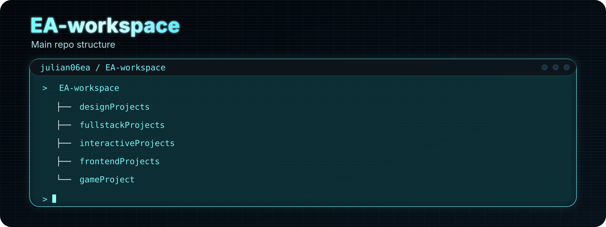

<h3 align="left">✦ About me</h3>
 

 

 

<a href="https://github.com/julian06ea/EA-workspace/tree/main/designProjects">Design</a>
&nbsp;•&nbsp;
<a href="https://github.com/julian06ea/EA-workspace/tree/main/fullstackProjects">Fullstack</a>
&nbsp;•&nbsp;
<a href="https://github.com/julian06ea/EA-workspace/tree/main/interactiveProjects">Interactive</a>
&nbsp;•&nbsp;
<a href="https://github.com/julian06ea/EA-workspace/tree/main/frontendProjects">Frontend</a>
&nbsp;•&nbsp;
<a href="https://github.com/julian06ea/EA-workspace/tree/main/gameProject">Games</a>

